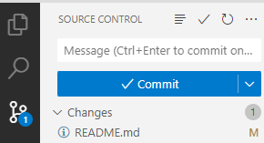

#This is my revision of GIT

#Steps to save and commit code using VS code:
1. Create a folder in your local drive
2. Open the same folder using VS code
3. Type "git init" in bash terminal
4. Create a README.md file for all your comments.
5. 
6. click on + and add your message in message box and click on commit
7. Prompt will come to create "Branch' usin Git public or private repo.Only one time.Use Public link always
8. Click on commit and your code is pushed.Refresh git and see!

Project Structure/Pipeline Structure:

